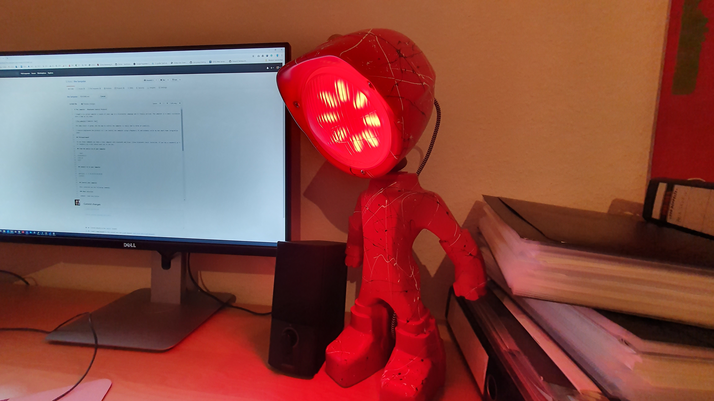

# The Lampster - Bluetooth Control Protocol

I bought a so called Lampster a couple of years ago in a Kickstarter campaign and it finally arrived. The Lampster is a small scultpture with a lamp as its head.



The lamp itself if great, but the app to control the lampster is really bad in terms of usability. 

I reverse engineered the protocol so I can control the lampster using a Raspberry Pi and probably write my own smart home integration later.

## Prerequirement

To use these commands you need a linux computer with bluetooth and bluez (linux bluetooth stack) installed. If you use a raspberry pi 3 or raspberry pi 4 this should work out of the box.

## Find the device id of your lampster

```bash
bluetoothctl
scan on
exit
```

## Connect to to your lampster

```
gatttool -I -b XX:XX:XX:XX:XX:XX
connect
```

## Control your lampster

Once connected use the following commands.

### Mode selection

command | mode description
--- | ---
char-write-req 0x0021 c0 | turn it on
char-write-req 0x0021 40 | turn it off
char-write-req 0x0021 a8 | activate RGB mode
char-write-req 0x0021 c8 | activate WHITE mode
char-write-req 0x0021 28 | activate OFF mode?!?

### White LEDs

Once you are in WHITE mode you can adjust the warm white and cold white LEDs with this command:

command | description
--- | ---
char-write-cmd 0x0025 WWCC | WW for warm white LEDs, CC for cold white LEDs

The values seem to be Hex and range from 00 to 64 (0 to 100%)

command | description
--- | ---
char-write-cmd 0x0025 0100 | lowest warm white intensity
char-write-cmd 0x0025 6400 | highest warm white intensity
char-write-cmd 0x0025 0001 | lowest cold white intensity
char-write-cmd 0x0025 0064 | highest cold white intensity
char-write-cmd 0x0025 1E1E | both 30% intensity
char-write-cmd 0x0025 6464 | both full intensity

### RGB LEDs

Once you are in RGB mode you can adjust the colors with this command:

command | description
--- | ---
char-write-cmd 0x002a RRGGBB | RR for red LEDs, GG for green LEDs, BB for blue LEDs

The values seem to be Hex and range from 00 to 64 (0 to 100%)

command | description
--- | ---
char-write-cmd 0x002a 010000 | RED lowest intensity
char-write-cmd 0x002a 640000 | RED highest intensity
char-write-cmd 0x002a 000100 | GREEN lowest intensity
char-write-cmd 0x002a 006400 | GREEN highest intensity
char-write-cmd 0x002a 000001 | BLUE lowest intensity
char-write-cmd 0x002a 000064 | BLUE highest intensity
char-write-cmd 0x002a 1E1E1E | all 30% intensity
char-write-cmd 0x002a 646464 | all full intensity
